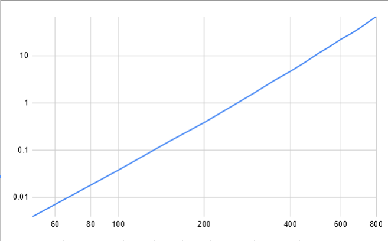

# Ant Colony System: Acceleration using OpenMP and CUDA

### *By Nathan Klisch*
*Nov 2, 2020*

The [Ant Colony System](http://people.idsia.ch/~luca/acs-ec97.pdf) (ACS) was developed by Marco Dorigo and Luca Maria Gambardella as an improvement over the [Ant System](http://www.cs.unibo.it/babaoglu/courses/cas05-06/tutorials/Ant_Colony_Optimization.pdf) that was also created by Marco Dorigo. The Ant System was inspired by how ant's use pheromones to help the colony find the shortest path to food and other resources.

The ACS is used to solve combinatorial  problems, like Traveling Salesman Problem(TSP) or Knapsack Problem. Good, near optimal solutions to large Traveling salesman problems are incredibly useful in a variety of fields from [Genome Sequencing](http://www.math.uwaterloo.ca/tsp/apps/genome.html) to minimizing [fuel use of spacecraft](http://www.math.uwaterloo.ca/tsp/apps/starlight.html). Exact algorithm's to solve a Traveling Salesman Problem are considered NP-hard - meaning currently there is no-known algorithm that can solve them in polynomial time. This is an issue because as the problem size grows the computation time grows exponentially, making large problems currently impossible to solve using an exact algorithm.

The Ant Colony System is a means to learn a near optimal solution more quickly. By simulating ant's moving around the graph, updating the pheromones as the travel from node to node and updating the global pheromone levels based on the best ant's tour, the ant's learn to find better and better solutions.
In the paper Dorigo showed that ACS is not only effective but it is relatively quick in comparison to other methods of the time. Dorigo also found that combining ACS with a 3-opt local optimization technique before calculating the global best Ant's tour make's ACS come close to finding close to the global minimum consistently even on larger problems. It also sped up the computation time as 3-opt helped improve the placement of the pheromones thus taking fewer iterations to find a good solution.

I have implemented a naive implementation of ACS in C++ and placed it on [github](https://github.com/nklisch/AntColony-Parallel-Optimized). This version of ACS does not have 3-opt implemented yet. I will be using this implementation as my benchmark to test it's current computation speed and area's where it can be improved. Improvement will include problem size reduction, efficient memory compression and organization for improved cache speeds and a combination of OpenMP and CUDA solutions.

## Execution Times

The given execution times are for a single iteration of ACS. In an actual problem, you would run many more iterations. I tested and the iteration steps is linear, so each additional iteration is simply multiplying the current execution time. These must be run in sequence due to the nature of the algorithm, so I am ignoring this parameter for this analysis and setting it to one for time.

The above graph shows us that this is growing either at a exponential or polynomial rate. I will plot this on different Log scales to determine which. It should be polynomial though.

This is the LogLog scale, as it is a straight line, we can tell that it is a polynomial function. 
All of the operations in the current implementation are of $O(n^2)$. So the polynomial should be of Order 2.
When I introduce 3-opt, it's naive implementation is $O(n^3)$. This would increase my current times by a factor of $n$. I will not be implementing the naive implementation. This leads to the improvements that will be implemented to speed this up and move much of the computation into near linear speed.

## Improvements

- **Reductions**: I will be modifying my code to use a candidate list that is each node's closes $m$ neighbors. The ACS and 3-opt algorithms will use this list in their decision making process. ACS will only venture past the candidate list if they have no other option, which is rare. This reduces the operations to $n \times m$. Since $m$ is constant this causes our computation to go to $\approx O(n)$. I will also be removing the random choice of all $n$ not in the candidate list for ACS-3-opt and instead choose the closest outside of the candidate list. This is following the improved algorithm suggested by Dorigo. This reduces computation as well.

- **Don't Look Bit**: I will also be implementing a don't look bit in the 3-opt search. This reduces the amount of computation neccisary to perform 3-opt which is $O(n^3)$ normally.

- **Memory Improvements**: I will be implementing all the 2D matrixes as 1D matrixes and with index transformations. This will guarantee concurrent memory allocation. I will be re-orginizing where the distances are stored, placing them at the end of the each Candidate List, since we always need the distance right after looking at the node. This will provide good memory locality and reduce cache misses. I will also be storing the distances at the end of the Tour and keeping a total distance as we add elements to the Tour. This will reduce computations and increase memory locality as well.
I will also compress what data I can into bit's where it makes sense. One area I considered doing this was in representing the Graph. Currently, my implementation assumes a fully connected symmetrical graph, which is common starting point for TSP problems. I want to eventually add support for Asymmetrical graphs. Eventually, if we can verify that a graph has a Hamiltonian Cycle, we can attempt to find the Optimal Cycle that minimizes the distance.

- **OpenMP**: I will be using OpenMP to run the Ants. Each Ant will be run by a thread. The only issue is I will need to use a Critical section for when the ant does a local update of the pheromones. The order in which the ant's traverse the board doesn't matter, and normally is fixed by a loop. By making them threads we actually introduce a feature of randomness that may improve the performance for this kind of problem. I will also use OpenMP for calculating the distance matrix at the start. Since each Ant run's their own 3-Opt, this will parallelize this operation as well. By leveraging the course grain parallelism in a way so that we have our candidate list length $m$ equal the number of ants, which will equal threads. This will allow us to divide out the $m$ term in our computation, hopefully leading to very fast calculations.

- **CUDA**: I will be implementing a CUDA kernel that processes the local search 3-opt. Based on my research, this should lead to a significant improvement in speed in this portion of the calculation. Based on this [paper](http://worldcomp-proceedings.com/proc/p2012/PDP7771.pdf) by Audrey Delévacq, Pierre Delisle, and Michaël Krajecki I should be able to see a significant speed up of 3-opt when the problem size gets large enough. To this end, I will have two implementations. One that uses CUDA when $n$ gets large enough and the other will stay on the CPU. I also hope to find a location in the normal ACS algorithm where it may make sense to ship off computation to the GPU. I may need to similarly detect problem sizes that are large enough for the delay of moving memory is worth it.

## Target
I hope to improve the speedup of this algorithm first by reduction from $O(n^2)$ and $O(n^3)$ to a $\approx O(n)$. Then, leveraging parallelism in both CUDA and OpenMP I want to get a overall speed up of $\times 10 \sim 20$ on problem sizes $n > 10,000$. This is justifiable as running each Ant seprately should be plenty of work to get a speed up near the number of ants. The CUDA implementation of 3opt according to Delévacq may be able to achieve speed ups between $\times 6 \sim 45$.
